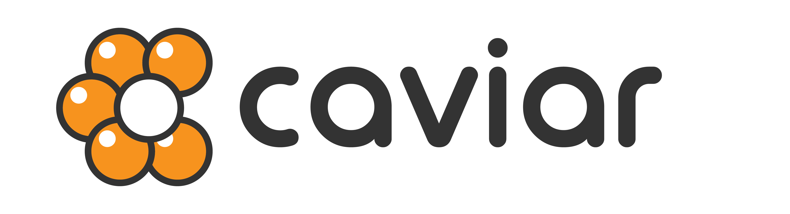

# 

[](https://travis-ci.org/kaelzhang/caviar)
[](https://codecov.io/gh/kaelzhang/caviar)
<!-- optional appveyor tst
[](https://ci.appveyor.com/project/kaelzhang/caviar)
-->
<!-- optional npm version
[](http://badge.fury.io/js/caviar)
-->
<!-- optional npm downloads
[](https://www.npmjs.org/package/caviar)
-->
<!-- optional dependency status
[](https://david-dm.org/kaelzhang/caviar)
-->

A pluggable and extendable web framework which integrates React, Next and Koa(Eggjs) to create your own web application out of the box with even zero configuration.

## Getting Started

```sh
mkdir hello && cd hello
yo generator-caviar
npm run dev
```

Yeah, we have our first application

### File Structure

```
project/
|-- app
|-- pages
|-- caviar.config
|   |-- .env
|   |-- client.env
|   |-- index.js
|-- package.json
|-- ...
```

## Thinking in `caviar`

****

> The sections below is for development purpose

## Extend `caviar` for your own business

### Config chain

## How to write caviar plugins

## API Documentation

```js
const {
  Sandbox,
  Server,
  ConfigLoader
} = require('caviar')
```

### new Sandbox(options)

- **options** `Object`
  - **cwd** `path` the current working directory
  - **port?** `number` server port
  - **dev?** `boolean=false` whether is for development purpose
  - **serverClassPath?** `path` the file path of the `Server` class. Defaults to the `Server` class path of the `caviar` project.
  - **configLoaderClassPath?** `path` the file path of the `ConfigLoader` class

Creates a new sandbox. Sandbox is design to filter the environment variables.

#### await sandbox.start()

Start the sandbox, and it will create a new `Server` by passing `{cwd, port, dev}` as options.

### new Server(options)

- **options** `Object`
  - **cwd**
  - **port?** `Number` `options.port` will override `config.port` of `caviar.config.js`
  - **dev?**
  - **configLoaderClassPath?**

Create a new `Server`

```js
const server = new Server({
  cwd,
  dev: true
})

await server.ready()
server.listen(8888)
```

#### await server.ready()

Initialize the server

#### server.callback(): Function

Returns a callback function suitable for the http.createServer() method to handle a request.

```js
require('http').createServer(server.callback())
```

This method must **NOT** be called before the server is ready (`await server.ready()`)

#### server.listen(port?)

- **port?** `number` optional server port. If `port` is specified, it will override `options.port`.

## License

[MIT](LICENSE)

****

<p align="right">Thanks <a href="https://github.com/reallinfo">@reallinfo</a> for the great logo<p>
